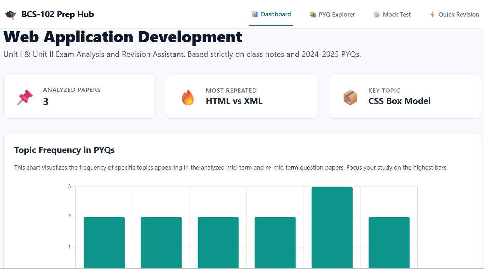
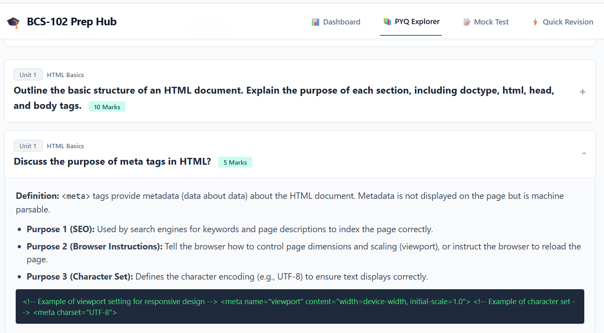

# 🎓 BCS-102 Prep Hub: Web Application Development

A comprehensive, non-linear study dashboard designed specifically for BCS-102 (Unit I & II) exam preparation. This tool moves away from traditional linear reading, allowing students to strategically diagnose weaknesses, explore past questions, and self-assess through interactive features.

## 🚀 How to Use

**🌟 The easiest way to access the study hub is to visit the live site directly:**

👉 [https://ananyajoshi-cseai.github.io/bcs102-prep-hub/](https://ananyajoshi-cseai.github.io/bcs102-prep-hub/)

Alternatively, to run it locally on your own machine:
1. Clone this repository or download the `index.html` file.
2. Double-click `index.html` to open it in any modern web browser.
3. Start studying!

## ✨ Key Features

### 📊 Dashboard & Analytics
Visualizes the frequency of specific topics appearing in past mid-term papers using a Chart.js bar chart, helping students quickly identify and prioritize high-yield exam topics.

### 📚 PYQ Explorer
A filterable database of Previous Year Questions (PYQs) organized by Unit and Topic. It uses an accordion-style layout to keep focus on one answer at a time, structured in a clear university exam format.

### 📝 Mock Test Generator
Automatically compiles a randomized 30-mark, 1.5-hour mock examination paper based on the weightage and patterns of previous Unit 1 and Unit 2 papers.

### ⚡ Quick Revision Sheets
A fast, tabbed interface providing ultra-concise cheat sheets, syntax guides, and key definitions for HTML, CSS (including the Box Model), and XML—perfect for night-before revision.

## 🛠️ Tech Stack

* **Frontend:** HTML5, Vanilla JavaScript
* **Styling:** Tailwind CSS (via CDN) for a responsive, clean, and focused UI using a calm slate and teal palette
* **Data Visualization:** Chart.js (via CDN)
* **Architecture:** Single Page Application (SPA)

## 👩‍💻 About the Developer

I am **Ananya Joshi**, a B.Tech student in **Computer Science and Artificial Intelligence** at **Indira Gandhi Delhi Technical University for Women (IGDTUW)**. I enjoy building tools that bridge the gap between complex data and user-friendly interfaces.

* **LinkedIn:** [ananya-joshi-cseai](https://www.linkedin.com/in/ananya-joshi-cseai/)
* **GitHub:** [@ananyajoshi-cseai](https://github.com/ananyajoshi-cseai)
* **Other Projects:** [After-Feel](https://github.com/ananyajoshi-cseai/after-feel) (AI Poetry Portfolio) and [CareerFlow AI](https://github.com/ananyajoshi-cseai/CareerFlow-AI).
---
*Built for BCS-102 Exam Preparation.*
